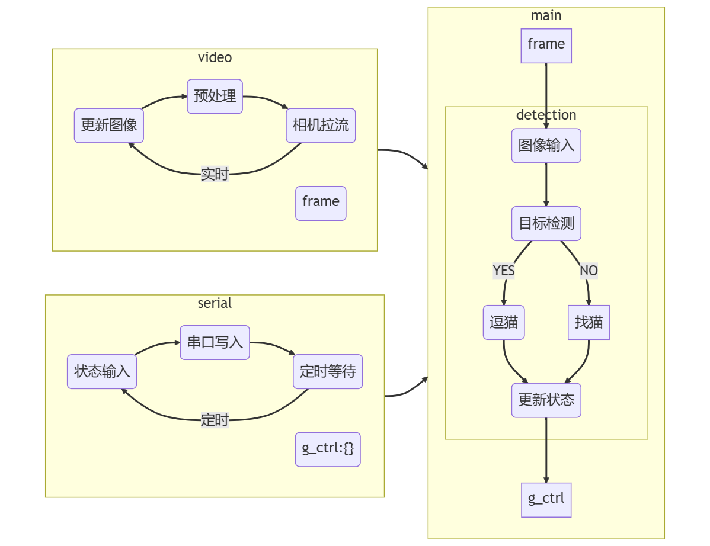
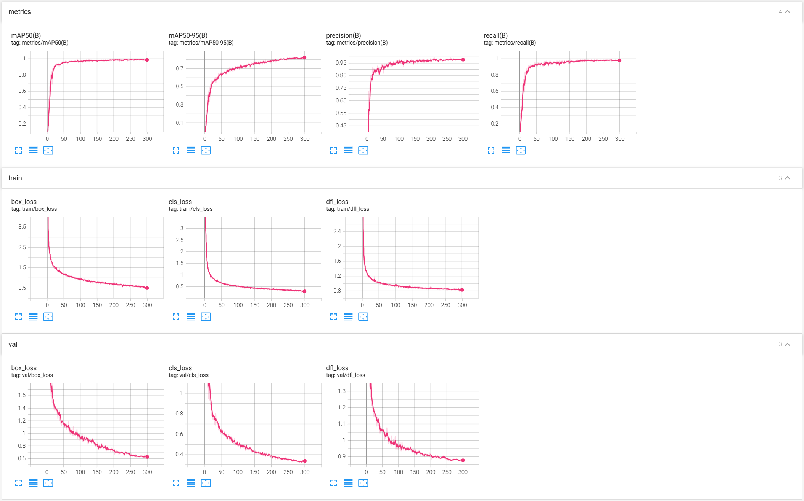
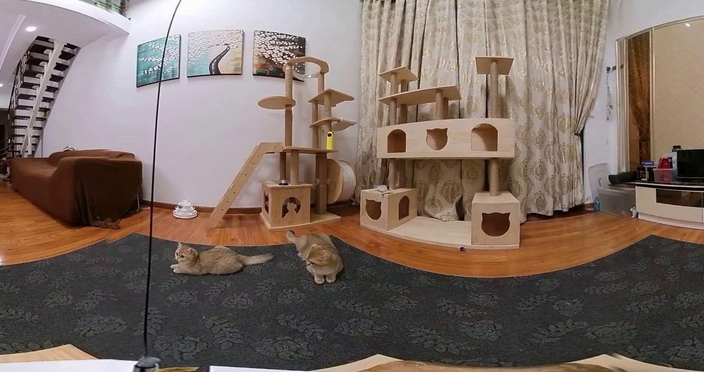
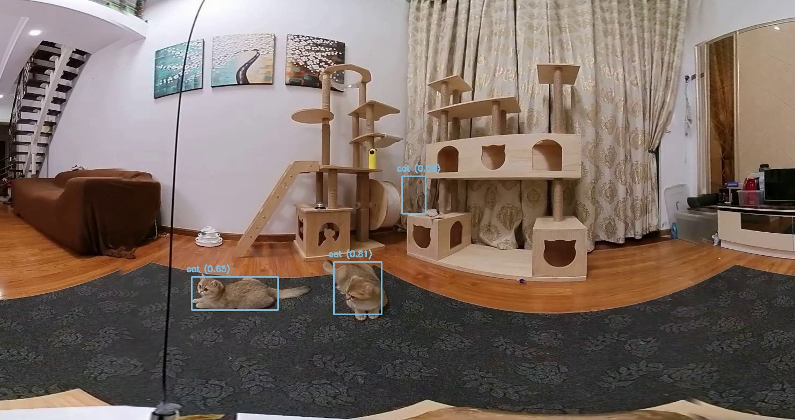

# 全自动逗猫

程序逻辑如下



- 当画面中没有猫并超过一定时间时，发送逗猫棒 "找猫" 的控制信息，未超过固定时间则继续等待
- 画面中有猫时，随机发送某一玩具的控制信息

## yolov8 目标检测训练与部署

### 模型训练

拍摄视频并导出图片，使用 **[Roboflow](https://roboflow.com/)** 进行标注


- 参照 [yolov8 训练自定数据集](https://sinnammanyo.cn/stack/cv/ml-dl/yolo/yolov8-train) 进行训练

```
yolo detect train data={path}/data.yaml model=yolov8s.yaml epochs=100 imgsz=640
```

训练 100 epochs 的结果


训练 300 epochs 的结果，模型精度有所提升，但并没有太大变化



### 部署
- [使用 CV::DNN 模块读取 ultralytics/YOLO-v8 ONNX 模型进行实时目标检测](https://sinnammanyo.cn/stack/cv/opencv/dnn/opencv-dnn-ultralytics)



``` py
import cv2
from yolov8_onnx import Model

net = Model( _classes_path="datasets/one-rs.yaml", _model_path="models/one-rs-640x.onnx", _size=(640, 640), _is_cuda=True)

src_img = cv2.imread("img/cat.jpg")
# have_person = False
# | OpenCV Predict | np.ndarray | HWC, BGR to RGB |
rgb_img = src_img[:, :, ::-1]
detections = net.det(rgb_img, _score_th=0.35, _NMS_th = 0.45)
for i in range(len(detections)):
    detection = detections[i]
    id = detection['class_id']
    name = net.CLASSES[id]
    if (name == 'cat' or name == 'dog'):
        have_cat = True
        draw_id = id if (name == 'cat') else (id-1)
        net.draw_bounding_box(src_img,
                            draw_id,  # only cat
                            detection['confidence'],
                            round(detection['box'][0] * detection['scale']),
                            round(detection['box'][1] * detection['scale']),
                            round((detection['box'][0] + detection['box'][2]) * detection['scale']),
                            round((detection['box'][1] + detection['box'][3]) * detection['scale']))

cv2.imshow('src', src_img)
cv2.waitKey(0)
```



从结果可以看出，模型有些过拟合，但是并不影响熬🐱的功能，凑合用吧~~~

## 参考
- **[ultralytics/ultralytics](https://github.com/ultralytics/ultralytics)**
- **[YOLOv8 Docs](https://docs.ultralytics.com/)**
- **[开始使用 - Roboflow](https://help.roboflow.com/cn_CN/get-started/dataset-upload-roboflow-data-types)**
- **[yolov8 训练自定数据集](https://sinnammanyo.cn/stack/cv/ml-dl/yolo/yolov8-train)**
- **[使用 CV::DNN 模块读取 ultralytics/YOLO-v8 ONNX 模型进行实时目标检测](https://sinnammanyo.cn/stack/cv/opencv/dnn/opencv-dnn-ultralytics)**
