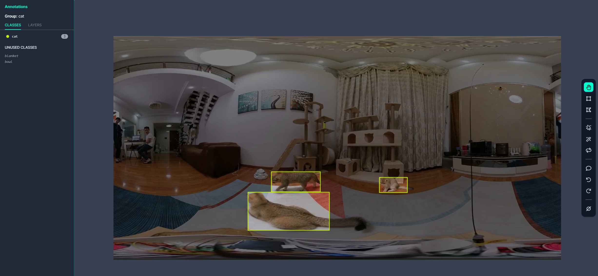
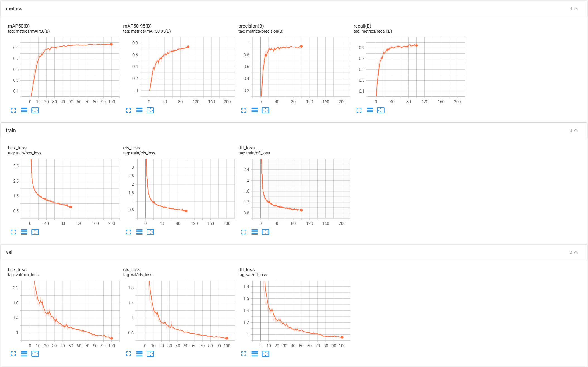
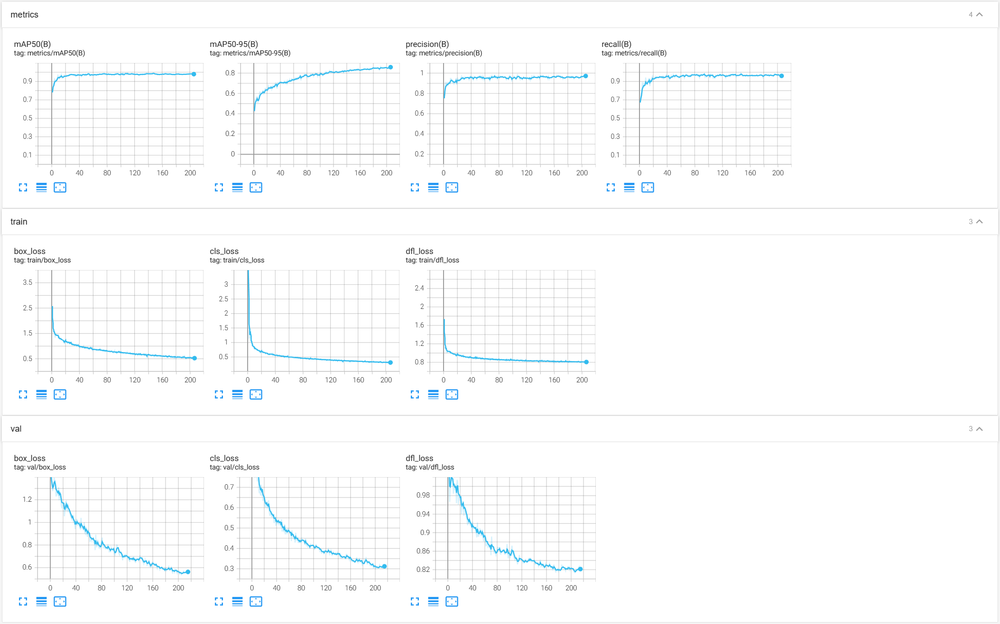

# yolov8 目标检测训练与部署

## 模型训练

拍摄视频并导出图片，使用 **[Roboflow](https://roboflow.com/)** 进行标注



- 参照 [yolov8 训练自定数据集](https://sinnammanyo.cn/stack/cv/ml-dl/yolo/yolov8-train) 进行训练

### 单目标训练

```
yolo detect train data={path}/data.yaml model=yolov8n.yaml epochs=100 imgsz=640
```

训练 100 epochs 的结果



### 从预训练权重训练

`Roboflow` 导出的数据集中，由于只标注了一个种类，导出后的 `data.yaml` 中 `nc` 为 1 ，与 `coco128.yaml` 的 nc 不对应，数据集中的 `label` 数据也不对应，要对数据集进行修改

- `data.yaml` 修改 nc 为 80，names 参照 `coco128.yaml` 修改

```
yolo detect train data={path}/data.yaml model=yolov8n.pt epochs=200 imgsz=640
```

训练 200 epochs 的结果，在预训练权重的基础上训练，模型精度并没有太大变化



### 部署
