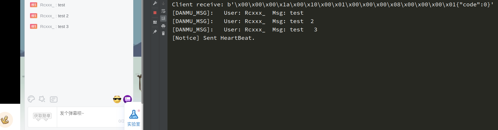
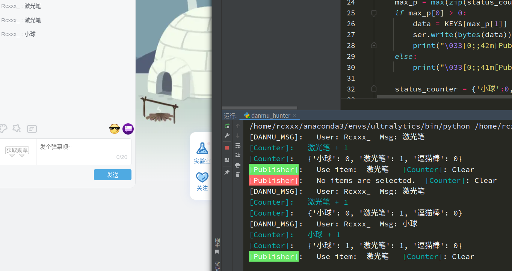

# 弹幕交互云逗猫
## 使用 aiowebsocket 实时获取 `B站` 弹幕数据



## 定时弹幕统计

通过异步操作，以 `SER_WRITE_INTERVAL` 为周期统计弹幕，启动得票数最多的玩具

``` py
...
SER_WRITE_INTERVAL = 10
await asyncio.sleep(SER_WRITE_INTERVAL)
...
```



## 参考
- **https://github.com/rcxxx/Bullet_Chat_Hunter**
